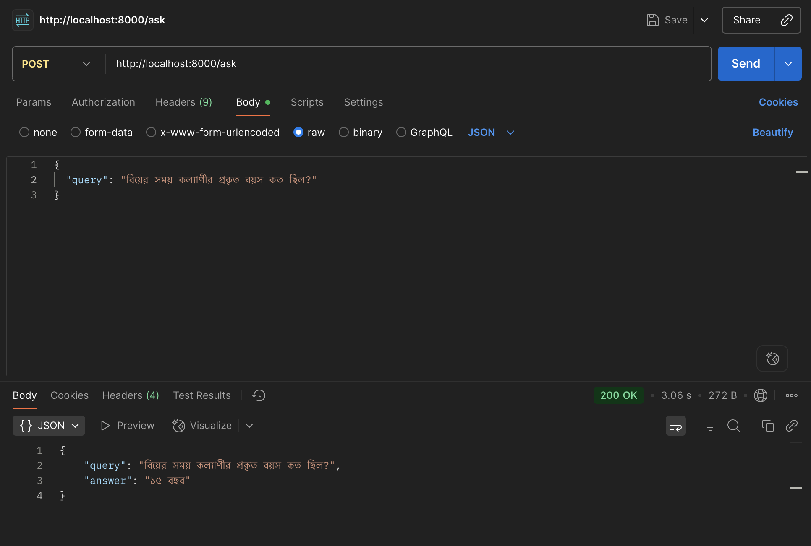
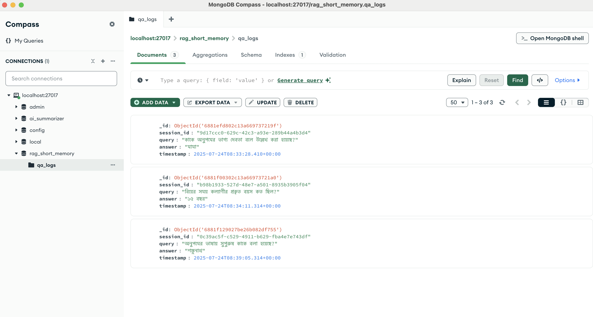

## 🧠 Multilingual RAG System – Bengali + English

**Level-1 AI Engineer Technical Assessment — 10 Minute School**

---

### 📌 Objective

Developed a Retrieval-Augmented Generation (RAG) pipeline capable of:

* Understanding both English and Bengali queries
* Retrieving relevant document chunks from a cleaned knowledge base
* Generating grounded answers using Large Language Models (LLMs)

---

## 🏗️ System Architecture

### 🔹 Step 1: Building the Vector Database (Knowledge Base Creation)

```
PDF Document (Bengali)
      ↓
Text Extraction (OCR)
      ↓
Preprocessing & Cleaning
      ↓
Text Chunking (Token-based)
      ↓
Embedding Generation (all-MiniLM-L6-v2)
      ↓
Store in Vector Database (FAISS)
```

---

### 🔹 Step 2: Query → Retrieval → LLM Answer Generation

```
User Query (Bengali or English)
      ↓
Query Translate(IF English)
      ↓
Query Embedding
      ↓
Vector Similarity Search (FAISS)
      ↓
Retrieve Top-k Relevant Chunks
      ↓
Inject into LLM Prompt
      ↓
LLM Generates Answer
```

---

## ⚙️ Tools & Libraries Used

| Component       | Tool / Library                               |
| --------------- | -------------------------------------------- |
| Text Extraction | OCR                                          |
| OCR Engine      | Mistral OCR (for Bengali PDF)                |
| Chunking        | `RecursiveCharacterTextSplitter` (LangChain) |
| Vector Database | FAISS                                        |
| Short-Term (Recent inputs store) | MongoDB                     |
| Embedding Model | `sentence-transformers/all-MiniLM-L6-v2`     |
| LLM (Cloud)     | Mistral (configurable)                       |
| API Framework   | FastAPI                                      |
| Env Management  | `dotenv`, `uvicorn`                          |
| Evaluation      | Cosine Similarity + Groundedness Check       |

---

## 📘 Dataset

* **Source PDF**: HSC26 Bangla 1st Paper (Official Bengali Literature Book)
* **Language**: Bengali
* **Challenges**: Native Bangla font, inconsistent formatting, OCR noise
* **Solution**: Used Mistral OCR for accurate extraction

---

## 🔎 Text Preprocessing

### Why Mistral OCR?

Initially, we attempted using traditional PDF-to-text libraries like `pdfplumber`, `PyMuPDF`, and `ocrmypdf`, but they failed to extract clean Bangla text due to font rendering issues. Image-based OCR (PDF to image → image to text) was also attempted but didn’t yield satisfactory results.

#### ❌ PDF Text Extraction Example:

```text
আি আমাি ব্ স সাতাি মাত্র । এ িীব্নটা না দদকঘিযি র্হসাকব্ ব়্ে , না গুকনি র্হসাকব্...
```

#### ✅ Mistral OCR Output Example:

```text
## মূল গল্প

আজ আমার বয়স সাতাশ মাত্র। এ জীবনটা না দৈর্ঘ্যের হিসাবে বড়, না গুনের হিসাবে...
```
---

### ⚙️ Challenges Faced

* **Bangla ligature errors** during OCR.
* **Noisy headers/footers** distorted clean text.
* **Column layouts** broke sentence flow.
* **Mixed language content** (e.g., English, Hindi) required filtering.
* **Image tags** were mistakenly processed as text.
* **MCQ structure issues**:

  * \~100 MCQs appeared together **without answers**.
  * Answers were listed **after** the full MCQ block.
  * A custom script was used to match and merge answers back with each question.

---

### 📝 Original MCQ:

```text
৬৬। 'আমার পিতা এক কালে গরিব ছিলেন' কার পিতা?
(ক) অনুপমের
(খ) কল্যাণীর
(গ) হরিশের
(ঘ) শম্ভুনাথ বাবুর

```

### ✅ Preprocessed MCQ:

```text
৬৬। 'আমার পিতা এক কালে গরিব ছিলেন' কার পিতা?
(ক) অনুপমের
(খ) কল্যাণীর
(গ) হরিশের
(ঘ) শম্ভুনাথ বাবুর

উত্তরঃ ক (অনুপমের)
```

---

### Fixes Applied:

* Regex-based postprocessing and normalization
* Token-based chunking with overlap

---

## 🧩 Chunking Strategy

* **Method**: Paragraph-based using `RecursiveCharacterTextSplitter`
* **Reason**:

  * Preserves semantic meaning
  * Prevents breaking of sentences mid-way
* **Config**:

  * `chunk_size = 4096`, `chunk_overlap = 300`

---

## 🧠 Embedding Model

* **Model**: `sentence-transformers/all-MiniLM-L6-v2`
* **Why Chosen**:

  * Multilingual support (English + Bangla)
  * Lightweight and fast
  * Great for semantic similarity tasks

---

## 🧮 Vector Search

* **Database**: FAISS (Fast Approximate Nearest Neighbor)
* **Similarity Metric**: Cosine Similarity
* **Why FAISS**:

  * Efficient local storage
  * Fast retrieval for real-time RAG tasks
  * Seamless integration with LangChain

---

## 🤖 RAG Answer Generation

* **LLM Used**: `mistral-large-latest` via API
* **Prompt Strategy**:

  * Inject top-K relevant chunks into the prompt context
  * Reformulate ambiguous queries internally (if needed)

---

## 🧪 Sample Test Cases

| User Query (Bengali)                            | Answer    |
| ----------------------------------------------- | --------- |
| অনুপমের ভাষায় সুপুরুষ কাকে বলা হয়েছে?         | শুম্ভুনাথ |
| কাকে অনুপমের ভাগ্য দেবতা বলে উল্লেখ করা হয়েছে? | মামাকে    |
| বিয়ের সময় কল্যাণীর প্রকৃত বয়স কত ছিল?        | ১৫ বছর    |

---

## 🧵 Memory Design

* **Short-Term**: Session-based conversation memory
* **Long-Term**: Vector DB for document context memory


### 🧠 Memory Design Summary

* **Short-Term Memory** (Chat History)

  * 📦 Stored in: `MongoDB`
  * 📌 Use: Maintain session-level conversation flow
  * 💬 Retrieves recent chat turns to provide context to LLM

* **Long-Term Memory** (Knowledge Base)

  * 📦 Stored in: `FAISS` Vector DB
  * 📌 Use: Retrieve semantically relevant document chunks using query embeddings
  * 🔍 Helps answer factual or context-heavy questions

* **Final Query**

  * 🔗 Combines: Retrieved documents (long-term) + recent chat (short-term) + current query
  * 🎯 Passed to LLM for accurate and contextual response


### 📸 Example Outputs & Screenshots

#### ✅ Sample API Query (Bangla)
> Query: ` বিয়ের সময় কল্যাণীর প্রকৃত বয়স কত ছিল?`  
> ✅ **Expected Answer:** `১৫ বছর`



---

#### 🧠 MongoDB Logs
Model interaction logs stored in MongoDB.




### 📚 Additional Documentation

To keep the main README clean and organized, we’ve separated the details into dedicated documents:
* 🛠️ **Setup Guide**: See [Setup Guidelines](Project_Setup.md) for complete instructions on how to set up the environment, run the project, and configure essential variables (like API keys and database connections via .env).
* 📘 **API Guide**: Follow the instructions in [API Documentation](API_Documentation.md) to test and interact with the available API endpoints.
* 📊 **System Evaluation**: See [Evaluation RAG System](Evaluation_RAG_System.md) for benchmarking methods and performance metrics of the RAG pipeline.
* ❓ **Assessment Q&A Responses**: Visit [Question Answer](Question_Answer.md) to understand how user queries are processed and answered through the system.

---

## ✅ Future Improvements

* Improved OCR for complex Bangla script
* RAG using hybrid search (BM25 + Embeddings)
* Interactive frontend (Gradio/Streamlit)
* LLM fine-tuning for better grounding on literature

---

## 🔗 GitHub Repository

📁 [https://github.com/raselmeya94/retrieval-augmented-qa-bangla](https://github.com/raselmeya94/retrieval-augmented-qa-bangla)

---

